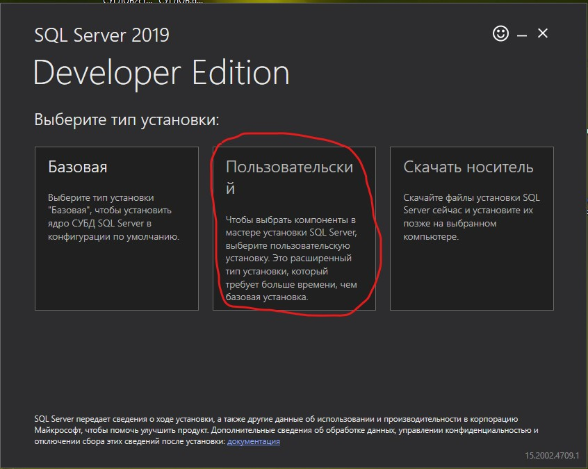
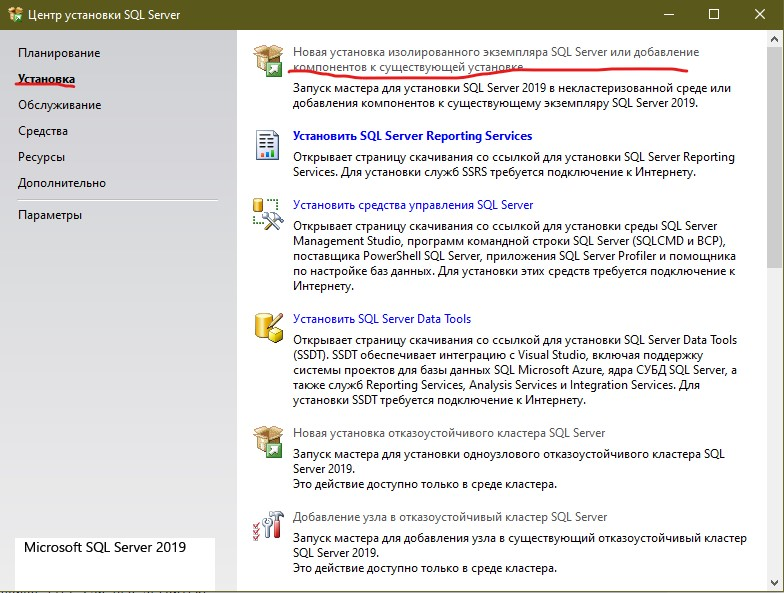
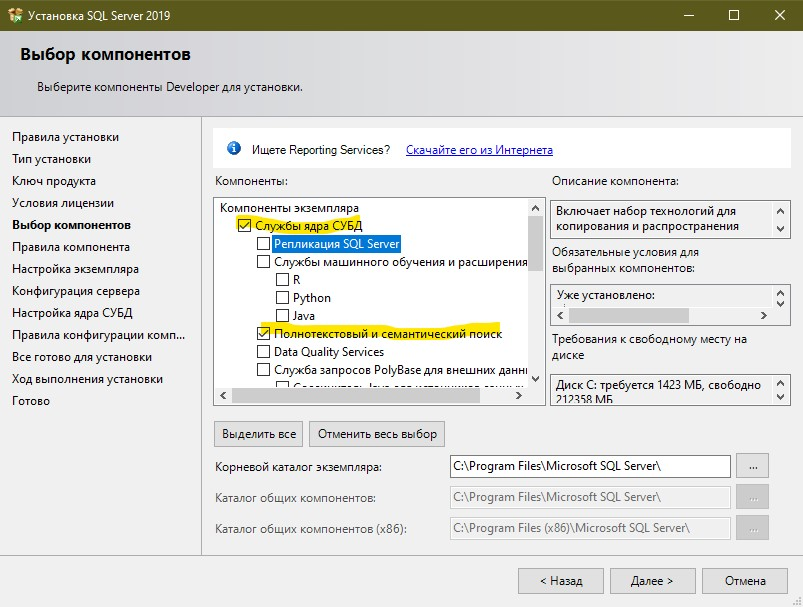
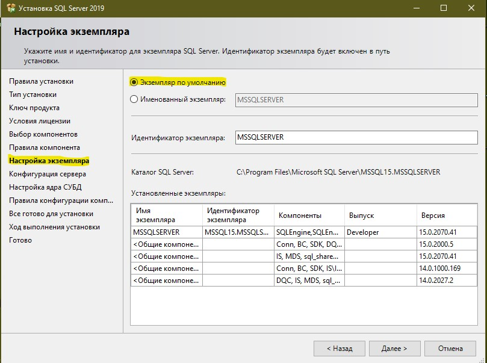
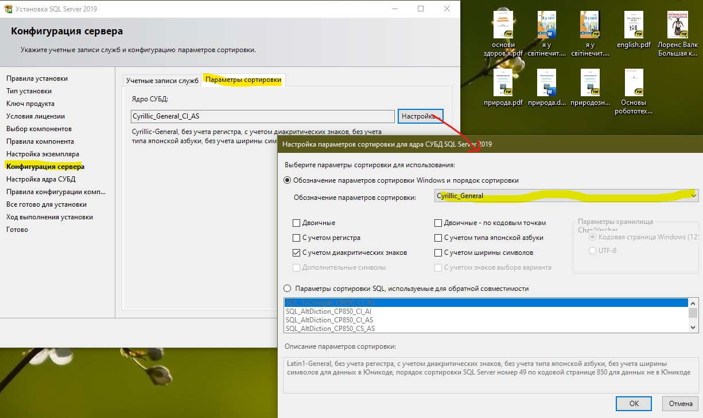
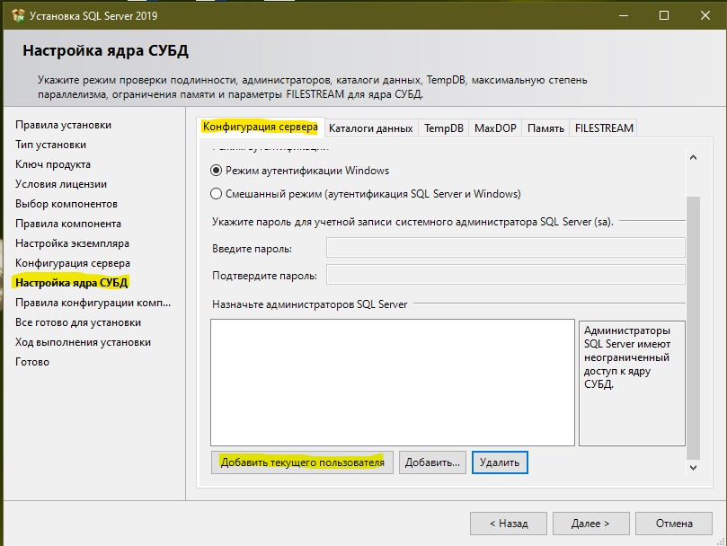

# Системные требования для сервера

**RAM:** минимум 2Gb

**ОС:** Windows 7, 8, 10

# Требования для веб-клиента (Браузер)

**Google Chrome** 57+

**Mozilla Firefox** 53+

**Microsoft Edge** 16+

**Safari** 11+

**Opera** 44+

```diff
- Internet Explorer не поддерживается!!!
```

# Установка необходимого ПО

Загрузить и установить [Visual Studo 2019 Community Edition](https://visualstudio.microsoft.com/ru/vs/community/) (Младшие версии не подойдут).

При установке выбрать пункты ASP.NET и разработка веб-приложений, Разработка мобильных приложений на .NET, Хранение и обработка данных, Кроссплатформенная разработка .NET Core

Скачать и установить последнюю версию [.NET Core SDK](https://dotnet.microsoft.com/download)

После установки открыть любое приложение командной строки (cmd или PowerShell) и выполнить
```
dotnet tool install --global dotnet-ef
```

Скачать и установить [Microsoft SQL Server 2019 Developer](https://www.microsoft.com/ru-ru/sql-server/sql-server-downloads)

Во время установки выбирать Пользовательский тип установки



После скачивания установочного пакета откроется Центр установки SQL Server. В нем в боковом меню нужно выбрать пункт **Установка** и на вкладке выбрать **Новая установка изолированного экземпляра SQL Server или добавлениие компонентов к существующей установке**



Далее принимаем лицензию и выбираем все пункты по умолчанию, кроме

На вкладке **Выбор компонетов** обязательно убеждаемся, что выбраны **Службы ядра СУБД** и **Полнотекстовый и семантический поиск**



На вкладке **Настройки экземпляра** выбираем **Экземпляр по умолчанию**



На вкладке **Конфигурация сервера** во вкладке **Параметры сортировки** выбрать **Cyrillic_General**



На вкладке **Настойка ядра СУБД** во вкладке **Конфигурация сервера** нажать внизу окна **Добавить текущего пользователя**



Для удобства работы с MS SQL Server можно (но не обязательно) скачать и установить [SQL Server Management Studio](https://docs.microsoft.com/ru-ru/sql/ssms/download-sql-server-management-studio-ssms?view=sql-server-ver15)


# Запуск приложения

Для запуска нужно запустить сервер данных (проект `AnyTest.DataService`) и веб-клиент (проект `AnyTest.WebClient`). Для этого нужно либо выбрать в свойстах решения несколько запускаемых проектов (правой кнопкой мыши на самом верхнем пункте в обозревателе решений -> Назначить запускаемые проекты -> в списке назначить `AnyTest.DataService` и `AnyTest.WebClient` пункт "Запускать") и затем запустить их в Visual Studio с помощью команы меню **Отладка -> Запуск без отладки** или сочетания клавиш *Ctrl+F5*.

Также можно запустить проекты вручную из командной строки. Для этого нужно перейти в папку с проектами `AnyTest/AnyTest.DataService` `AnyTest/AnyTest.WebClient`, запустить там утилиту командной строки (cmd или powershell) и выполнить команду `dotnet run`

# Вход в приложение

После первого запуска создается аккаунт администратора по умолчанию с логином `admin` и паролем `Admin_1`

# Резервные копии баз данных

В репозиторий добавлены резервные копии баз данных: общей базы (`main.bak`) и базы данных пользователей (`identity.bak`).

Чтобы иметь возможность получить их при клонировании или пулл-реквесте репозитория, необходимо скачать и установить [Git Large File Storage](https://git-lfs.github.com/). После установки больше ничего делать не надо, файлы резервных копий будут скачиваться как любые другие файлы в репозитории. Восстановить базы из резервных копий можно при помощи **Microsoft SQL Server Management Studio**

В базе пользователей присутсвуют аккаутны преподавателя (логин `tutor` пароль `Tutorr_1`) и студента (логин `student` пароль `Student_1`), которые можно использовать для тестирования соответсвующих функций.